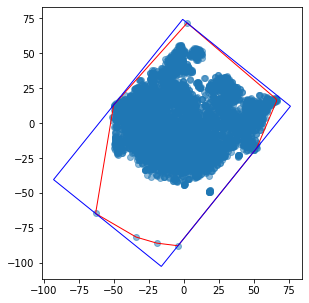
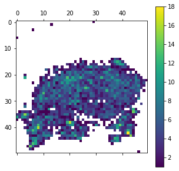
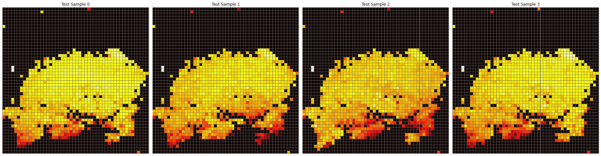

# DeepInsight

This repository contains a python version of the image transformation procedure described in the paper [DeepInsight: A methodology to transform a non-image data to an image for convolution neural network architecture](https://doi.org/10.1038/s41598-019-47765-6).

## Installation

```
sudo pip install git+git://github.com/alok-ai-lab/DeepInsight.git#egg=DeepInsight
```

## Usage

The following is a walkthrough of standard usage of the ImageTransformer class

```python
from pyDeepInsight import ImageTransformer
from sklearn.model_selection import train_test_split
import pandas as pd
import numpy as np
from matplotlib import pyplot as plt
```
Load example TCGA data

```python
expr_file = r"./data/tcga.rnaseq_fpkm_uq.example.txt.gz"
expr = pd.read_csv(expr_file, sep="\t")
y = expr['project'].values
X = expr.iloc[:, 1:].values
X_train, X_test, y_train, y_test = train_test_split(
    X, y, test_size=0.2, random_state=23, stratify=y)
X_train.shape
```
    (480, 5000)

Normalize data to values between 0 and 1. The following normalization procedure is described in the [DeepInsight paper supplementary information](https://static-content.springer.com/esm/art%3A10.1038%2Fs41598-019-47765-6/MediaObjects/41598_2019_47765_MOESM1_ESM.pdf) as norm-2.

```python

gene_min = X_train.min(axis=0)

X_train_norm = np.log(X_train + np.abs(gene_min) + 1)
norm_max = X_train_norm.max()
X_train_norm = X_train_norm/norm_max

X_test_norm = np.log(X_test + np.abs(gene_min) + 1).clip(0,None)
X_test_norm = (X_test_norm/norm_max).clip(0, 1)

```
Initialize image transformer.

```python
it = ImageTransformer(feature_extractor='tsne', 
                      pixels=50, random_state=1701, 
                      n_jobs=-1)
```

Train image transformer on training data. Setting plot=True results in at a plot showing the reduced features (blue points), convex full (red), and minimum bounding rectagle (blue box) prior to rotation.

```python
plt.figure(figsize=(5, 5))
it.fit(X_train_norm, plot=True)
```



The feature density matrix can be extracted from the trained transformer in order to view overall feature overlap.

```python
fdm = it.feature_density_matrix()
fdm[fdm == 0] = np.nan

fig = plt.figure(figsize=(5, 5))
ax = fig.add_subplot(111)
cax = ax.matshow(fdm, vmin=1)
fig.colorbar(cax)
plt.gca().set_aspect('equal', adjustable='box')
plt.show()
```



The trained transformer can then be used to transform sample data to image matricies.

```python
mat_train = it.transform(X_train_norm)
```

Fit and transform can be done in a single step.

```python
mat_train = it.fit_transform(X_train_norm)
```
The following are showing plots for the image matrices first four samples of the training set. 

```python
fig, ax = plt.subplots(1, 4, figsize=(15, 10))

for i in range(0,4):
    ax[i].matshow(mat_train[i])
    ax[i].axis('off')
plt.show()
```


Transforming the testing data is done the same as transforming the training data.

```python
mat_test = it.transform(X_test_norm)

fig, ax = plt.subplots(1, 4, figsize=(15, 10))

for i in range(0,4):
    ax[i].matshow(mat_test[i])
    ax[i].axis('off')
plt.show()
```



The images matrices can then be used as impute for the CNN model.