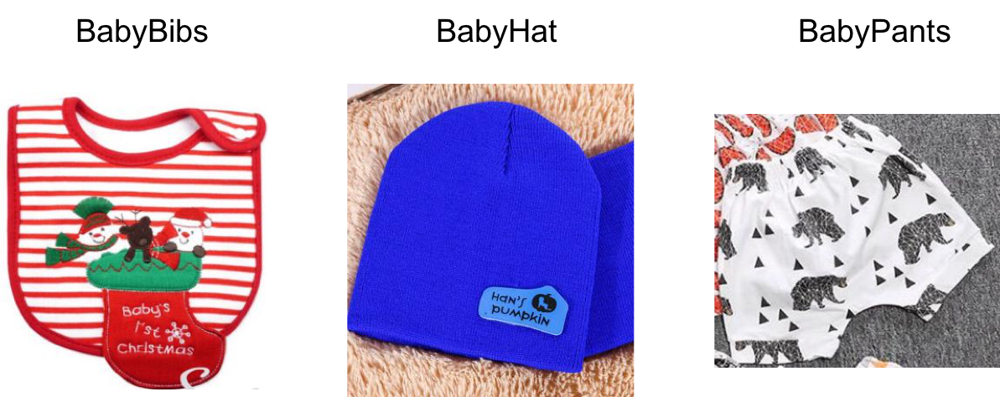

# Image Prediction - How to Use Your Own Datasets

This tutorial demonstrates how to use AutoGluon with your own custom datasets.
As an example, we use a dataset from Kaggle to show the required steps to format image data properly for AutoGluon.

## Step 1: Organizing the dataset into proper directories

After completing this step, you will have the following directory structure on your machine:

```
    data/
    ├── class1/
    ├── class2/
    ├── class3/
    ├── ...
```

Here `data` is a folder containing the raw images categorized into classes. For example, subfolder `class1` contains all images that belong to the first class, `class2` contains all images belonging to the second class, etc.
We generally recommend at least 100 training images per class for reasonable classification performance, but this might depend on the type of images in your specific use-case.

Under each class, the following image formats are supported when training your model:

- JPG
- JPEG
- PNG

In the same dataset, all the images should be in the same format. Note that in image classification, we do not require that all images have the same resolution.

You will need to organize your dataset into the above directory structure before using AutoGluon.
Below, we demonstrate how to construct this organization for a Kaggle dataset.

### Example: Kaggle dataset

Kaggle is a popular machine learning competition platform and contains lots of
datasets for different machine learning tasks including image classification.
If you don't have Kaggle account, please register one at [Kaggle](https://www.kaggle.com/).
Then, please follow the [Kaggle installation](https://github.com/Kaggle/kaggle-api/) to obtain access to Kaggle's data downloading API.

To find image classification datasets in Kaggle, let's go to [Kaggle](https://www.kaggle.com/)
and search using keyword `image classification` either under `Datasets` or `Competitions`.

For example, we find the `Shopee-IET Machine Learning Competition` under the `InClass` tab in `Competitions`.

We then navigate to [Data](https://www.kaggle.com/c/shopee-iet-machine-learning-competition/data) to download the dataset using the Kaggle API.
Please make sure to click the button of "I Understand and Accept" before downloading the data.

An example shell script to download the dataset to `./data/shopeeiet/` can be found here: [download_shopeeiet.sh](https://github.com/zhanghang1989/AutoGluonWebdata/blob/master/docs/tutorial/download_shopeeiet.sh?raw=True).

After downloading this script to your machine, run it with:

```
import autogluon.core as ag
ag.download('https://raw.githubusercontent.com/zhanghang1989/AutoGluonWebdata/master/docs/tutorial/download_shopeeiet.sh')
!sh download_shopeeiet.sh
```

Now we have the desired directory structure under `./data/shopeeiet/train/`, which in this case looks as follows:

```
    shopeeiet/train
        ├── BabyBibs
        ├── BabyHat
        ├── BabyPants
        ├── ...
    shopeeiet/test
        ├── ...
```

Here are some example images from this data:




## Step 2: Split data into training/validation sets

A fundamental step in machine learning is to split the data into disjoint sets used for different purposes.

**Training Set**: The majority of your data should be in the training set.
This is the data use to train your model:
data is used to learn the parameters of the model,
namely the weights of the neural network classifier.

**Validation Set**: A separate validation set (sometimes also called the dev set)
is also used during AutoGluon's training process. While neural network weights are updated based on the training data,
each neural network requires the user to specify many hyperparameters (e.g., learning rates, etc.). The choice of hyperparameters greatly impacts the training process and resulting model.  AutoGluon automatically tries many different values of these hyperparameters and evaluates each hyperparameter setting by measuring the performance of the resulting network on the validation set.

**Test Set**: A separate set of images, possibly without available labels. These data are never used during any part of the model construction or learning process. If unlabeled, these may correspond to images whose labels we would like to predict. If labeled, these images may correspond to images we reserve for estimating the performance of our final model.

### Automatic training/validation split

AutoGluon automatically does Training/Validation split:

```
from autogluon.vision import ImagePredictor
dataset = ImagePredictor.Dataset.from_folder('./data/shopeeiet/train')
```

AutoGluon automatically infers how many classes there are based on the directory structure.
By default, AutoGluon automatically constructs the training/validation set split:

- Training Set: 80% of images.
- Validation Set: 20% of images.

where the images that fall into the validation set are randomly chosen from the training data based on the class.

## Step 3: Use AutoGluon fit to generate a classification model

Now that we have a `Dataset` object, we can use AutoGluon's default configuration to obtain an image classification model using the [`fit`](/api/autogluon.task.html#autogluon.task.ImagePredictor.fit) function.

Due to the large size of the Kaggle dataset,
calling `fit` without specifying a time limit may result in long waiting times.
Run the following commands to run `fit` using a time limit:

```
time_limit = 10 * 60 # 10mins
predictor = ImagePredictor()
predictor.fit(dataset, time_limit=time_limit)
```

The top-1 accuracy of the best model on the validation set is:

```
print('Top-1 val acc: %.3f' % predictor.fit_summary()['valid_acc'])
```

###  Using AutoGluon to Generate Predictions on Test Images

We can ask our final model to generate predictions on the provided test images.
We first load the test data as a `Dataset` object and then call `predict`:

```
test_dataset = ImagePredictor.Dataset.from_folder('./data/shopeeiet/test')
pred = predictor.predict(test_dataset)
print(pred)
```

Here are the results of AutoGluon's default `fit` and `predict` under different `time_limit` when executed on a p3.16xlarge EC2 instance:

- The validation top-1 accuracy within 5h is 0.842, and ranks 14th place in Kaggle competition.
- The validation top-1 accuracy within 24h is 0.846, and ranks 12th place in Kaggle competition.
- The validation top-1 accuracy within 72h is 0.852, and ranks 9th place in Kaggle competition.


## Step 4: Submit test predictions to Kaggle

If you wish to upload the model's predictions to Kaggle, here is how to convert them into a format suitable for a submission into the Kaggle competition:

```
import autogluon.core as ag
ag.utils.generate_csv(pred['id'].tolist(), './submission.csv')
```

This produces a submission file located at: `./submission.csv`.

To see an example submission, check out `sample submission.csv` at this link: [Data](https://www.kaggle.com/c/shopee-iet-machine-learning-competition/data).

To make your own submission, click [Submission](https://www.kaggle.com/c/shopee-iet-machine-learning-competition/submit)
and then follow the steps in the submission page (upload submission file, describe the submission,
and click the `Make Submission` button). Let's see how your model fares in this competition!
