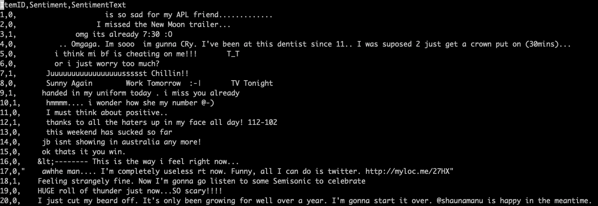

# Text Classification - How to Use Your Own Datasets
:label:`sec_textown`

This tutorial demonstrates how to use AutoGluon with your own custom text datasets on a typical text classification problem, i.e., sentiment classification.
As an example, we use a dataset from Kaggle to show what steps are needed to use text data properly for AutoGluon.

## Step 1: Download or bring your own dataset

After completing this step, you will have the following directory structure on your machine:

```
    data/
    ├── train.*
    ├── test.*
```

Here `data` is a folder containing the raw text samples categorized into train and test dataset (`*` represents the file format/extension). 
For example, with `csv` as the file format, raw training set `train.csv` contains all texts of the raw training data, where each row represents each sample in the training data, the first column is `id` of the text in the first column, the second column is the `label` of the text, the third column is the `text`.
`test.csv` contains all text belonging to the test set, where the first column is the `id` of the text and second column is the `text`.
We generally recommend at least 100 training samples per class for reasonable classification performance, but this might depend on the type of text in your specific use-case.

The following text file formats are supported when training your model:

- txt
- csv/tsv
- json

You will need to organize your dataset into the above structure before using AutoGluon.
Below, we demonstrate how to construct this structure for a Kaggle dataset.

### Example: Kaggle dataset

Kaggle is a popular machine learning competition platform and contains lots of
datasets for different machine learning tasks including text classification.
If you don't have Kaggle account, please register one at [Kaggle](https://www.kaggle.com/). 
Then, please follow the [Kaggle installation](https://github.com/Kaggle/kaggle-api/) to obtain access to Kaggle's data downloading API.

To find text classification datasets in Kaggle, let's go to [Kaggle](https://www.kaggle.com/), since we would use sentiment analysis as an example,
and let's search using keyword `sentiment analysis` either under `Datasets` or `Competitions`. For example, we find the `Twitter sentiment analysis Competition`.

We then navigate to [Data](https://www.kaggle.com/c/twitter-sentiment-analysis2/data) to download the dataset using the Kaggle API.

An example shell script to download the dataset to `~/data/twittersa/` can be found here: [download_twittersa.sh](../../static/download_twittersa.sh).

After downloading this script to your machine, run it with:

```{.python .input}
# import os
# os.system('wget http://autogluon-hackathon.s3-website-us-west-2.amazonaws.com/static/download_twittersa.sh')
# os.system('sh download_twittersa.sh')
```

Now we have the desired directory structure under `~/data/twittersa/`, which in this case looks as follows:

```
    twittersa
    ├── train.csv
    ├── test.csv
```

Here are some example sentences from this data:




## Step 2: Split data into training/hpo validation/test sets

A fundamental step in machine learning is to split the data into disjoint sets used for different purposes.

Training Set: The majority of your data should be in the training set.
This is the data your model sees during training:
it is used to learn the parameters of the model,
namely the weights of the neural network classifier.

HPO Validation Set: Note the HPO Validation Set is different from the traditional validation set concept, since the validation set is only used for evaluation purpose without massively tuning the hyper-parameters. A separate validation set (sometimes also called the dev set)
is also used during AutoGluon's training process. While neural network weights are updated based on the training data, 
each neural network requires the user to specify many hyperparameters (eg. learning rates, etc.) that will greatly affect the training process.  AutoGluon automatically tries many different values of these hyperparameters and evaluates each hyperparameter setting by measuring the performance of the resulting network on the validation set.

Test Set: A separate set of text, possibly without available labels. These data are never used during any part of the model construction or learning process. If unlabeled, these may correspond to text whose labels we would like to predict. If labeled, these text may correspond to text we reserve for estimating the performance of our final model.


### Dataset format after splitting

The following directory format is used by AutoGluon's `TextClassification` task:

```
    data/
    ├── train.*
    ├── hpo_val.*
    └── test.*
```

Here, the `train.*` file has the same format as the `data` directory described in Step 1.

When there are no labels available for test text, the `test.*` file simply has the same format with `test.*` described in Step 1.
Otherwise, `test.*` should have the same format as `train.*` if we wish to evaluate the accuracy of our model on the test data using AutoGluon.

We show an example below on how to convert data source obtained in Step 1
to Training/HPO Validation/Test split with the required format.  
In this example, we provide a script to split the Kaggle data into the required format;
please click the download link of [prepare_twittersa.py](../../static/prepare_twittersa.py).

### Automatic training/hpo validation split

Since AutoGluon provides the automatic Training/HPO Validation split, we can skip the HPO Validation split by running the command:

```{.python .input}
# import os
# os.system('wget http://autogluon-hackathon.s3-website-us-west-2.amazonaws.com/static/prepare_twittersa.py')
# os.system('python prepare_twittersa.py --data ~/data/twittersa/ --split 0')
```

where `--split 0` would skip the hpo validation split, therefore all the data samples in `train.*` would be used as `train` data, later on the AutoGluon `Dataset` would automatically split into Training (90% of the data) and HPO Validation (10% of the data).

The resulting data should be converted into the following directory structure:

```
    twittersa
    ├── train.csv
    └── test.csv
```

Now you have the datasets ready used in AutoGluon.

To tell AutoGluon where the training data is located, which means let AutoGluon conduct the Training/HPO Validation split, use:  

```{.python .input}
# from autogluon import TextClassification as task
# dataset = task.Dataset(name='twittersa', train_path='~/data/twittersa/train.csv')
```

AutoGluon will automatically infer how many classes there are based on the training data. 
By default, AutoGluon automatically constructs the training/hpo validation set split:

- Training Set: 90% of text.
- HPO Validation Set: 10% of text.

where the text that fall into the hpo validation set are randomly chosen from the training data based on the class.

### Manually-specified training/hpo validation split

Instead, you can also split your labeled data manually into training and hpo validation sets.
Manually splitting your data is a good choice when you want to exercise more control over the process
or if there are specific text that you're sure you want included in a certain part of your model or is critical in training lifecycle.

If we want to manually specify the Training/HPO Validation split, we could construct by running the command:

```{.python .input}
# import os
# os.system('wget http://autogluon-hackathon.s3-website-us-west-2.amazonaws.com/static/prepare_twittersa.py')
# os.system('python prepare_twittersa.py --data ~/data/twittersa/ --split 9')
```

where `--split 9` would sample 10% data from the raw `train` data as HPO Validation set, and the rest 90% data would be Training set.

The resulting data should be looking as the following structure:

```
    twittersa
    ├── train.csv
    ├── hpo_val.csv
    └── test.csv
```


We have the processed dataset if you don't want to explore new Kaggle dataset, please simply download it and try the larger dataset.
Then tell AutoGluon where the training and hpo validation data is, which means we disable AutoGluon's automatic Training/HPO Validation split functionality, instead, we manually provide the Training/HPO Validation split via:

```{.python .input}
# import os
# os.system('wget http://autogluon-hackathon.s3-website-us-west-2.amazonaws.com/twittersa/data_twittersa.zip')
# os.system('unzip -o data_twittersa.zip -d ~/')
```

```{.python .input}
# from autogluon import TextClassification as task
# dataset = task.Dataset(name='twittersa', path='~/data/twittersa/train.csv')
# hpo_val_dataset = task.Dataset(path='~/data/twittersa/hpo_val.csv')
```

## Step 3: Use AutoGluon fit to generate a classification model (Optional)

Now that we have a `Dataset` object, we can use AutoGluon's default configuration to obtain a text classification model.
All you have to do is simply call the `fit` function. 

Due to the large size of the Kaggle dataset and time constraints of this demo,
we don't recommend directly running `fit` here since it will take a while to execute.

On your own, please feel free to try running the following commands with small time limits (just uncomment the code):

```{.python .input}
# time_limits = 10 * 60 # 10mins
# predictor = task.fit(train=dataset, hpo_val=hpo_val_dataset, time_limits=time_limits)
```

The top-1 accuracy of the best model on the hpo validation set is:

```{.python .input}
# print('Top-1 acc: %.3f' % predictor.results['best_reward'])
```

###  Using AutoGluon to generate predictions on test sentences 

We can ask our final model to generate predictions on the provided test sentences.
We first load the test data as a `Dataset` object and then call [predict](../api/autogluon.task.base.html#autogluon.task.base.BaseTask.predict):

```{.python .input}
# test_dataset = task.Dataset(path='/home/ubuntu/data/twittersa/test.csv')
# inds = predictor.predict(test_dataset)
# probs = predictor.predict_proba(test_dataset)
```

`inds` above contains the indices of the predicted class for each test sentence, while `probs` contains the confidence in these predictions.

## Step 4: Submit test predictions to Kaggle (Optional)

If you wish to upload the model's predictions to Kaggle, here is how to convert them into a format suitable for a submission into the Kaggle competition:

```{.python .input}
# import autogluon as ag
# ag.utils.generate_csv(inds, '/home/ubuntu/data/twittersa/submission.csv')
```

will produce a submission file located at: `~/data/twittersa/submission.csv`.

To see an example submission, check out the file `sample submission.csv` at this link: [Data](https://www.kaggle.com/c/twitter-sentiment-analysis2/data).

To make your own submission, click [Submission](https://www.kaggle.com/c/twitter-sentiment-analysis2/submit)
and then follow the steps in the submission page (upload submission file, describe the submission,
and click the `Make Submission` button). Let's see how your model fares in this competition!

At the end, please remember to safely exit to release all the resources:

```{.python .input}
# ag.done()
```
