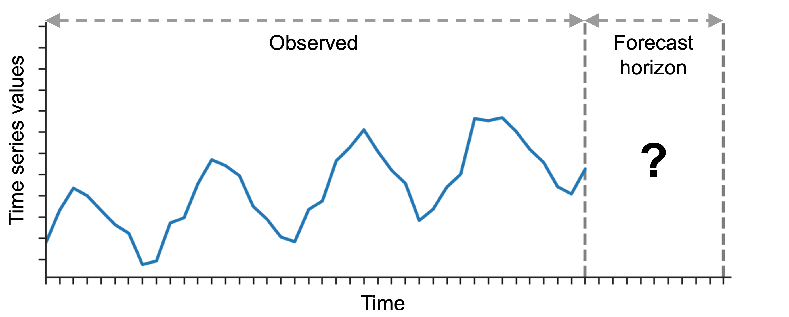
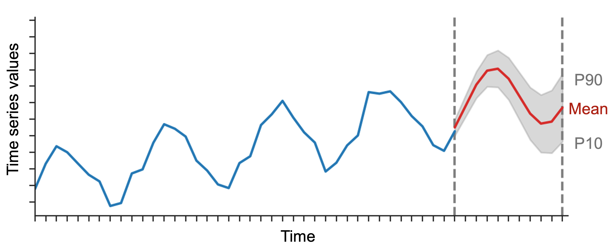
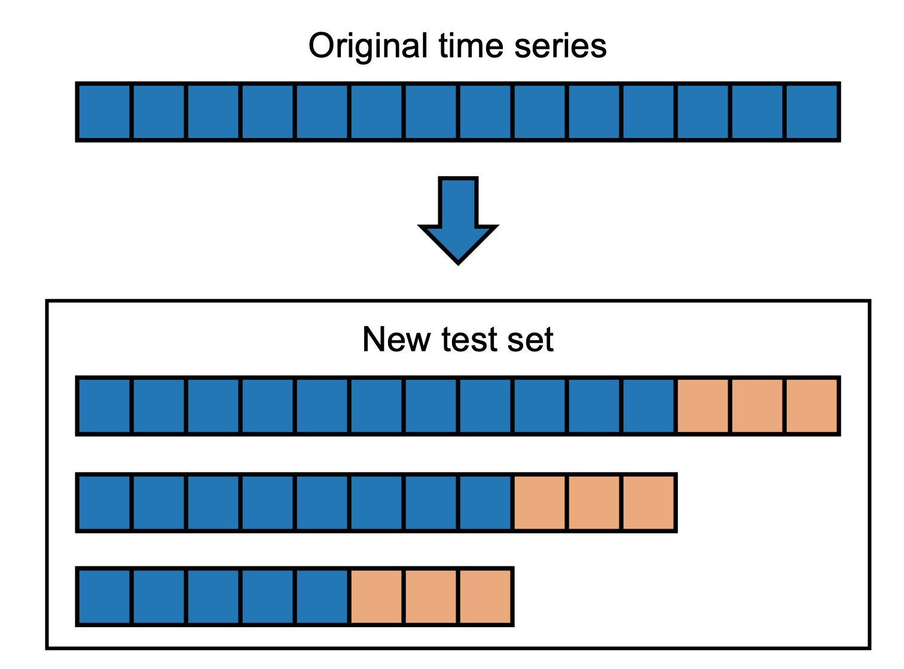

# Forecasting Time Series - In Depth
:label:`sec_forecastingadvanced`

This tutorial provides an in-depth overview of the time series forecasting capabilities in AutoGluon.

- What is probabilistic time series forecasting?
- What forecasting models are available in AutoGluon?
- How does AutoGluon evaluate performance of time series models?
- What functionality does `TimeSeriesPredictor` offer?
    - Choosing the presets
    - Manually specifying what models should be trained
    - Hyperparameter tuning
    - Forecasting irregularly-sampled time series

This tutorial assumes that you are familiar with the contents of the [basic tutorial](forecasting-quickstart.md).

## What is probabilistic time series forecasting?
A time series is a sequence of measurement made at regular intervals.
The main objective of time series forecasting is to predict the future values of a time series given the past observations.

A typical example of this task is demand forecasting.
We can represent the number of daily purchases of a certain product as a time series.
The goal in this case can be to predict the demand for each of the next 14 days given the historical purchase data.

In AutoGluon, the `prediction_length` argument of the `TimeSeriesPredictor`
determines the length of the forecast horizon.

<!--  -->
<p style="text-align:center;">

</p>


The [`predict`](https://auto.gluon.ai/stable/api/autogluon.predictor.html#autogluon.timeseries.TimeSeriesPredictor.predict) method of a `TimeSeriesPredictor` generates two types of forecasts:

- **mean forecast** represents the expected value of the time series at each time step in the forecast horizon.
- **quantile forecast** represents the quantiles of the forecast distribution.
For example, if the `0.1` quantile (also known as P10) is equal to `x`, it means that the time series value is predicted to be below `x` 10% of the time.

The quantiles can be used to reason about the range of possible outcomes.
For instance, by the definition of the quantiles, the time series is predicted to be between the P10 and P90 values with 80% probability.


<!--  -->
<p style="text-align:center;">

</p>

By default, the predictor outputs the quantiles `[0.1, 0.2, 0.3, 0.4, 0.5, 0.6, 0.7, 0.8, 0.9]`. You can train the predictor with custom quantiles using the `quantile_levels` argument
```python
predictor = TimeSeriesPredictor(quantile_levels=[0.05, 0.5, 0.95])
```


<!-- More abstractly, we can represent the past observations of the time series as a vector $(y_1, y_2, ..., y_T)$ of arbitrary length $T$.
The goal of forecasting is to predict the future values of the time series $(y_{T+1}, y_{T+2}, ..., y_{T+H})$.
Here $H$ is the length of the forecast horizon that we call `prediction_length` in AutoGluon.

... which means that all models ... *probability distribution*

$$p(y_{T+1}, y_{T+2}, ..., y_{T+H} | y_1, y_2, ..., y_T)$$ -->


<!-- ### How does training work?

After we finished training, AutoGluon outputs the list of available models


When we call `predictor.predict`, it makes prediction using the model that had the best validation loss

Can also override to make predictions


A `TimeSeriesPredictor` in AutoGluon is trained to predict multiple related time series simultaneously.


(for example, demand for different item categories) -->


<!-- AutoGluon provides two types of forecasts:

- mean forecast
- quantile forecast represents the range of possible outcomes -->

<!-- In language of AutoGluon `prediction_length` defines the length of the forecast horizon.


Predicting multiple time series --- predicting demand for different product categories.

Univariate - we model each time series independently. -->


## What forecasting models are available in AutoGluon?
Forecasting models in AutoGluon can be divided into three broad categories: local, global, and ensemble models.

**Local models** are simple statistical models that are specifically designed to capture patterns such as trend or seasonality.
Despite their simplicity, these models often produce reasonable forecasts and serve as a strong baseline.
Available local models include:

- `ETS`
- `ARIMA`

If the dataset consists of multiple time series, we fit a separate local model to each time series — hence the name "local".
This means, if we want to make a forecast for a new time series that wasn't part of the training set, all local models will be fit from scratch for the new time series.

**Global models** are deep-learning-based algorithms that learn a single model from the entire training set consisting of multiple time series.
AutoGluon relies on [GluonTS](https://ts.gluon.ai/stable/) for the implementation of global models in PyTorch and MXNet.
Available global models include:

- `DeepAR`
- `SimpleFeedForward`
- `Transformer`
- `MQRNN`
- `MQCNN`
- `TemporalFusionTransformer`

Finally, an **ensemble** model works by combining predictions of all other models.
By default, `TimeSeriesPredictor` always fits a `WeightedEnsemble` on top of other models.
This can be disabled by setting `enable_ensemble=False` when creating the predictor.

For a list of tunable hyperparameters for each model, their default values, and other details see [Model zoo](#TODO).

## How does AutoGluon evaluate performance of time series models?
AutoGluon evaluates the performance of a forecasting model by measuring how well its forecast aligns with the actually observed time series.
We can evaluate the performance of a trained predictor on `test_data` using the `evaluate` method
```python
# Fit a predictor to training data
predictor = TimeSeriesPredictor(prediction_length=3, eval_metric="MAPE")
predictor.fit(train_data=train_data)
# Evaluate the predictor on test data
predictor.evaluate(test_data)
```
For each time series in `test_data`, the predictor does the following:

1. Hide the last `prediction_length` values of the time series.
2. Generate a forecast for the hidden part of the time series using the model.
3. Quantify how well the model's forecast matches the actually observed (hidden) values of the time series using the `eval_metric`.

Finally, the scores are averaged over all time series in the dataset.

The crucial detail here is that `evaluate` always computes the score on the last `prediction_length` time steps of each time series.
The beginning of each time series (except the last `prediction_length` time steps) is only used to initialize the models before forecasting.

### Multi-window backtesting

If we want to perform _multi-window backtesting_ (i.e., evaluate performance on multiple forecast horizons generated from the same time series), we need to generate a new test set with multiple copies for each original time series.
This can be done using a `MultiWindowSplitter`.
```python
from autogluon.timeseries.spitter import MultiWindowSplitter

splitter = MultiWindowSplitter(num_windows=3)
_, test_data_multi_window = splitter.split(test_data, prediction_length)

predictor.evaluate(test_data_multi_window)
```
The new test set `test_data_multi_window` will now contain `num_windows` time series for each original time series in `test_data`.
The score will be computed on the last `prediction_length` time steps of each time series (marked in orange).

<p style="text-align:center;">

</p>

### How to choose and interpret the evaluation metric?
Different evaluation metrics capture different properties of the forecast, and therefore depend on the application that the user has in mind.
For example, weighted quantile loss (`"mean_wQuantileLoss"`) measures how well-calibrated the quantile forecast is; mean absolute scale error (`"MASE"`) compares the mean forecast to a naive baseline.
For more details about the available metrics, see [Metrics overview](#TODO).

Note that AutoGluon always reports all metrics in a **higher-is-better** format.
For this purpose, some metrics are multiplied by -1.
For example, if we set `eval_metric="MASE"`, the predictor will actually report `-MASE` (i.e., MASE score multiplied by -1). This means the `test_score` will be between 0 (best possible forecast) and $-\infty$ (worst possible forecast).


### How does AutoGluon select the best model?
When we fit the predictor with `predictor.fit(train_data=train_data)`, under the hood AutoGluon splits the original dataset `train_data` into train and validation parts.

The validation part of the data is used


You can provide a custom validation dataset to the predictor using the `tuning_data` argument: `predictor.fit(..., tuning_data=tuning_data)`.


Important point - when a `TimeSeriesDataFrame` is used for validation, only the last `prediction_length` timesteps are used for computing the validation score


## What functionality does `TimeSeriesPredictor` offer?
AutoGluon offers multiple ways to configure the behavior of a `TimeSeriesPredictor` that are suitable for both beginners and expert users.

### Basic configuration with `presets` and `time_limit`
We can fit `TimeSeriesPredictor` with different pre-defined configurations using the `presets` argument of the `fit` method.

```python
predictor = TimeSeriesPredictor()
predictor.fit(train_data=train_data, presets="medium_quality")
```

Higher quality presets, in general, result in better forecasts but take longer to train.
The following presets are available:

**TODO: These will be significantly changed by 0.6.0**

- `"low_quality"`: quickly train a few toy models. This setting should only be used as a sanity check.
- `"medium_quality"`: train several selected models (`"ETS"`, `"ARIMA"`, `"DeepAR"`, `"SimpleFeedForward"`) without hyperparameter optimization. A good baseline setting.
- `"high_quality"`: same as `"medium_quality"`, but with an extended model zoo (+ `"MQRNN"`, `"Transformer"`, `"TemporalFusionTransformer"`).
- `"best_quality"`: Train all available models with hyperparameter optimization.

Another way to control the training time is using the `time_limit` argument.

```python
predictor.fit(
    train_data=train_data,
    time_limit=60 * 60,  # total training time in seconds
)
```

If no `time_limit` is provided, the predictor will train until all models have been fit.


### Manually specifying what models should be trained
Advanced users can override the presets and manually specify what models should be trained by the predictor using the `hyperparameters` argument.


```python
predictor = TimeSeriesPredictor()

predictor.fit(
    train_data=train_data,
    hyperparameters={
        "DeepAR": {},
        "ETS": {
            "seasonality": "add",
            "seasonal_period": 7,
        }
    }
)
```
The code above will only train two models:

- `DeepAR` (with default hyperparameters)
- `ETS` (with the given `seasonality` and `seasonal_period`; all other parameters set to their defaults).

For the full list of available models and the respective hyperparameters, see [Model zoo](#TODO).

### Hyperparameter tuning
Advanced users can define search spaces for model hyperparameters and let AutoGluon automatically determine the best configuration for the model.

```python
import autogluon.core as ag

predictor = TimeSeriesPredictor()

predictor.fit(
    train_data=train_data,
    hyperparameters={
        "DeepAR": {
            "num_layers": ag.Categorical(2, 3, 4),
            "num_cells": ag.Int(10, 30),
        }
    },
    enable_ensemble=False,
)
```
This code will train multiple versions of the `DeepAR` model with different hyperparameter configurations.
AutGluon will automatically select the best model configuration that achieves the highest validation score and use it for prediction.


### Forecasting irregularly-sampled time series
By default, `TimeSeriesPredictor` expects the time series data to be regularly sampled (e.g., measurements done every day).
However, in some applications, like finance, data often comes with irregular measurements (e.g., no stock price is available for weekends or holidays).

To train on such irregularly-sampled time series, we can set the `ignore_time_index` flag in the predictor.
```python
predictor = TimeSeriesPredictor(..., ignore_time_index=True)
predictor.fit(train_data=train_data)
```
In this case, the predictor will completely ignore the timestamps in `train_data`, and the predictions made by the model will have a dummy `timestamp` index with frequency equal to 1 second.
Also, the seasonality will be disabled for models like as `ETS` and `ARIMA`.
