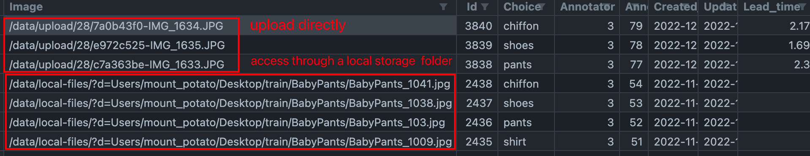
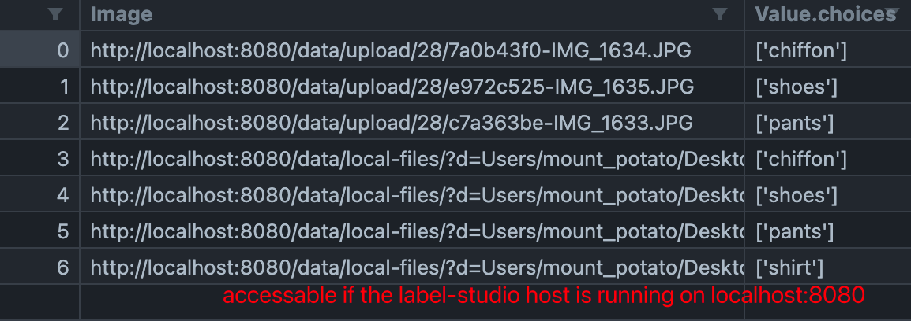
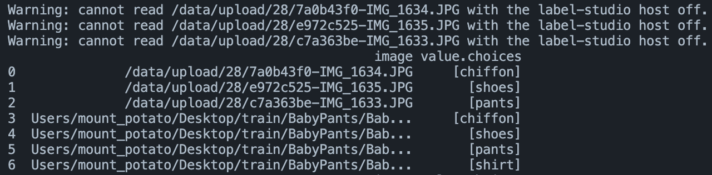
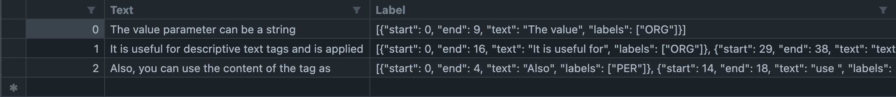
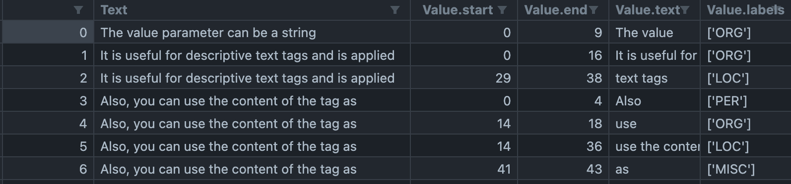

# Label-Studio Export file reader

the Label-Studio export file reader for Autogluon is used for transforming the labeling result in the labeling tool Label-Studio (https://labelstud.io/) into the Dataframe input for Autogluon multimodals.

## Label-Studio Export knowledge

### 1. General

The **Label-Studio export file** takes in the form like **CSV, JSON,  JSON-MIN, etc.** The export form details can be viewed in the Label-Studio official documentation(https://labelstud.io/guide/export.html). 

### 2. Getting files from Label-Studio host

For the annotation of files like image, it usually requires an additional JSON files to indicate their URL. But if user didn't provide the URL itself (just simply dragging the files into the Label-Studio Web UI), Label-Studio will generate a URL with the host of Label-Studio for these files, and user can access them on the condition that the label-studio host is on.These files will be unreachable if the label-studio host is turned off.

### 3. Label-Studio Templates

Label-Studio annotation templates are a set of default labeling tasks that help users to quickly annotation the data for certain type of tasks. The task templates supported by Label-Studio can be seen at https://labelstud.io/playground/


## How to Use

We should create an Label-Studio Reader object first by:

```python
from autogluon.multimodal.utils import LabelStudioReader

# initialize LabelStudioReader with default localhost host
ls = LabelStudioReader() 

# set 
ls.set_labelstudio_host("http://localhost:8080")
```

the `LabelStudioReader` should be initialized with an given label-studio host. If it's not given by the user, the  LabelStudioReader's default port is http://localhost:8080, which is Label-Studio's default host & port on a local machine. **If user import the files directly into Label-Studio Web without given the file's original URL, this host param will help user to access these files when users set** `ls_host_on=True`.


 `LabelStudioReader`  allows resetting the host by calling `set_labelstudio_host`.


On the first PR of this function, we provide 3 types of tasks to handle the Label-Studio export files. **CSV and JSON(JSON-MIN) files are supported so far**. 

```python
# transforming the export files from Label-Studio image classification template (image)
df, labels = ls.from_image_classification("ic.json", ls_host_on=False) 

# transforming the export files from Label-Studio named entity recognition template (text)
df, labels = ls.from_named_entity_recognition('neg.json')

# transforming the export files from user's customized labeling template
df, labels=ls.from_customized('custom.csv',
                              ls_host_on=True, 
                              data_columns=['image1','image2','image3'],
                              label_columns=['label'])
```


### Explanations of parameters

####  `ls_host_on` 

If user follows the Label-Studio's import data instruction(https://labelstud.io/guide/tasks.html#How-to-import-your-data) and provide a list of URLs in a TXT, CSV, or TSV file, or reference the URLs in JSON, their file export will contains the data file's URL. In this way they don't need the Label-Studio host to address the data, so they can set the `ls_host_on` to `False` (default value).

However, if the labeling tasks contains data that are imported directly through Label-Studio Web UI, it's recommended to set the `ls_host_on` to `True` and make sure the Label-Studio Web UI host is on.

Some examples are given below to demonstrate the impact of the value of  `ls_host_on` .


####  `data_columns` and `label_columns`

These two params indicate the data and label contents of an exported file that user want to set. 

- exported through CSV:  `data_columns` and `label_columns` here refer to a list of the CSV column names of the data or the labels. For example, if a ".csv" table of a 2-image classificiation export file has two image columns "image1" and "image2" that contains the image urls of the dataset, and their label column names are "label", we should set `data_columns=['image1','image2']` and `label_columns=['label']` to extract the columns
-  exported through JSON-MIN: The JSON-MIN template can be seen in https://labelstud.io/guide/export.html#JSON-MIN, here `data_columns` and `label_columns` here refer to a list of the .json key names of the data or the labels. For the given examples in the link above, we should set `data_columns=['image']` and `label_columns=['tag']` .
- exported through JSON:  The JSON template can be seen in https://labelstud.io/guide/export.html#Label-Studio-JSON-format-of-annotated-tasks, which is rather complex.  To handle nested JSON objects, a normalization under the record path `['annotations','result']` is conducted, which provides nested parsing for the `label_columns`. For the given examples of the object detection demo in the link above, we should set  `data_columns=['image']` and `label_columns=['value.height','value.rectanglelabels','value.rotation','value.width','value.x','value.y']` .


### Example 1. data with files  

we use the label-studio **Image Classification Template** export file to demonstrate how we deal with data with files. In this use case, user:

- Choose "Image Classification" template in Label-Studio
- Annotate the images in Label-Studio 
- Click "Export" and choose the export format
- Call `from_image_classification` to transform the export file into the Dataframe for Autogluon input (Autogluon's Image Classification support: https://auto.gluon.ai/stable/tutorials/multimodal/image_prediction/beginner_image_cls.html)


The params of `from_image_classification` are as follows:

|     Param     |   Type    | Optional |                         Description                          |
| :-----------: | :-------: | :------: | :----------------------------------------------------------: |
|     path      |    Str    |          |                 the path of the export file                  |
|  ls_host_on   |  Boolean  |          | Whether user need to access some files through label-studio host. |
| data_columns  | List[Str] |    √     | the key or column name(s) of the data.By default we use the given name from the image classfication template.If users change the name in the template, they should provide the data column names here |
| label_columns | List[Str] |    √     | the key or column name(s) of the label, similar to the situation for data_columns |


Normally,  data with files like images should be provided with their URL as we mentioned. We preprocess the data in the data columns as follows corresponding to the value of `ls_host_on`:


|            Data            | accessible if ls_host_on=True | accessible if ls_host_on=False | Description                                                  | Preprocess                                                   |
| :------------------------: | :---------------------------: | :----------------------------: | ------------------------------------------------------------ | ------------------------------------------------------------ |
| file url, text content,... |               √               |               √                |                                                              | Not doing anything                                           |
|     "/data/upload/..."     |               √               |               X                | use didn't provide url of the image, just import the image directly in LS | [ls_host_on=True]:   join with the label-studio host(e.g: http://locahost:8080/data/upload/...), when the LS host is on, the file is accessible<br />[ls_host_on=False]: cannot access |
|  "/data/local-files/..."   |               √               |         √(conditional)         | use didn't provide url of the image, instead they set up a local storage in LS. | [ls_host_on=True]:   join with the label-studio host(e.g: http://locahost:8080/data/upload/...)<br />[ls_host_on=False]: reserve the local path of the data files(if the root of the dataset is not moved) |
|            ...             |                               |                                |                                                              |                                                              |


An demo export files of Label-Studio export file:



An demo output with `ls_host_on=True` :



An demo output with `ls_host_on=False` :

(the "uploaded" data will be warned for not accessible)



### Example 2. Text annotations  (URL not required )

To we use the label-studio **named entity recognition** export file to demonstrate cases like this. In this use case, user: 

- Choose "named entity recognition" template in Label-Studio

- Annotate the images in Label-Studio 

- Click "Export" and choose the export format

- Call `from_named_entity_recognition` to transform the export file into the Dataframe for Autogluon input（Autogluon's NER support: https://auto.gluon.ai/stable/tutorials/multimodal/text_prediction/ner.html）

  

Since there're no potential URL issues, the `ls_host_on` param is removed in cases like this. The params of `from_named_entity_recognition` are as follows:

|     Param     |   Type    | Optional |                         Description                          |
| :-----------: | :-------: | :------: | :----------------------------------------------------------: |
|     path      |    Str    |          |                 the path of the export file                  |
| data_columns  | List[Str] |    √     | the key or column name(s) of the data.By default we use the given name from the image classfication template.If users change the name in the template, they should provide the data column names here |
| label_columns | List[Str] |    √     | the key or column name(s) of the label, similar to the situation for data_columns |


NOTE:

**Cases like named entity recognition and object detection may have multiple labels on single text or image files, therefore the label columns will be nested.  Currently the ` LabelStudioReader` only implements nested data parsing for JSON, CSV and JSON-MIN is not supported yet **. Therefore it's recommended to export JSON files. We will working on nested data parsing on CSV and JSON-MIN in the future.


The processed result of a CSV and JSON-MIN file:



 (the Label column are nested data about NER's labeling information)


The processed result of a JSON file:




### Example 3. Customized template

If user create their own Label-Studio template and export the annotations, they can call `from_customized` to transform the export file into the Dataframe for Autogluon input. In this case, user should provide the `data_columns` and `label_columns` to identify the data and label content.


The params of `from_customized` are as follows:

|     Param     |   Type    | Optional |                         Description                          |
| :-----------: | :-------: | :------: | :----------------------------------------------------------: |
|     path      |    Str    |          |                 the path of the export file                  |
|  ls_host_on   |  Boolean  |          | Whether user need to access some files through label-studio host. |
| data_columns  | List[Str] |          |            the key or column name(s) of the data             |
| label_columns | List[Str] |          |            the key or column name(s) of the label            |

