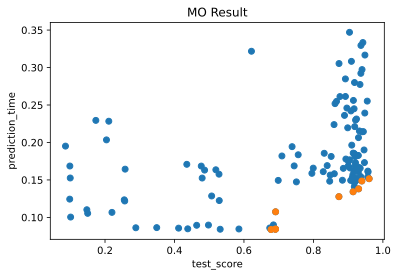

## Example: Multi-objective Asynchronous Successive Halving


This notebook provides an example for AutoGluon's multi-objective HPO capabilities. Using the MNIST toy problem we show how to use the MOASHAScheduler to search for neural network hyperparameters which lead to networks with accurate and fast predictions.

The overall handling is very similar to the standard HyperbandScheduler. The constructor signature differs in two attributes:

1. **objectives**: This attribute is used to specify the objectives of interests. It expects a dictionary. The dictionary values  are used to indicate if a particular objective is meant to be maximized ("MAX") or minimized ("MIN"). 
2. **type**: There are two supported types "eps_net" and "nsga_ii" that determine the exploration strategy.


```python
# imports
import time
import numpy as np
import autogluon.core as ag
import matplotlib.pyplot as plt
from collections import defaultdict 
from sklearn.datasets import fetch_openml
from sklearn.neural_network import MLPClassifier
```

### Get MNIST data


```python
X, y = fetch_openml('mnist_784', version=1, return_X_y=True)
X = X / 255.
X_train, X_test = X[:60000], X[60000:]
y_train, y_test = y[:60000], y[60000:]
classes = np.unique(y)
```

### Define a training function that returns multiple objectives


```python
# Specify search space for MLPs
@ag.args(
    n_layers=ag.space.Int(1, 4),
    layer_1=ag.space.Int(2, 32),
    layer_2=ag.space.Int(2, 32),
    layer_3=ag.space.Int(2, 32),
    layer_4=ag.space.Int(2, 32),
    alpha=ag.space.Real(1e-6, 1e-1, log=True),
    learning_rate_init=ag.space.Real(1e-6, 1e-2, log=True),
    beta_1=ag.space.Real(0.001, 0.99, log=True),
    beta_2=ag.space.Real(0.001, 0.99, log=True),
    tol=ag.space.Real(1e-5, 1e-2, log=True),
    epochs=50)
def train_fn(args, reporter):

    # Initialize model with args
    hidden = [args.layer_1, args.layer_2, args.layer_3, args.layer_4][:args.n_layers]
    mlp = MLPClassifier(hidden_layer_sizes=hidden,
                        alpha=args.alpha,
                        learning_rate_init=args.learning_rate_init,
                        beta_1=args.beta_1,
                        beta_2=args.beta_2,
                        tol=args.tol,
                        verbose=False)

    # Train model iteratively
    for e in range(args.epochs):
        mlp.partial_fit(X_train, y_train, classes)
        train_score = mlp.score(X_train, y_train)
        test_score = mlp.score(X_test, y_test)
        start = time.time()
        mlp.predict(X_train)
        prediction_time = time.time() - start

        # Ensure to return all quantities of interest
        reporter(epoch=e+1, train_score=train_score, test_score=test_score, prediction_time=prediction_time)
```

### Run hyperparameter search


```python
# Objectives are specified as dictionary with indication if they should be 
# maximized or minimized
objectives = {
    "test_score": "MAX",
    "prediction_time": "MIN"
}

# Exploration types are "eps_net" and "nsga_ii"
type = "eps_net"

scheduler = ag.scheduler.MOASHAScheduler(
    train_fn,
    resource={'num_cpus': 4, 'num_gpus': 0},
    num_trials=40,
    objectives=objectives,
    time_attr='epoch',
    grace_period=1,
    reduction_factor=3,
    type=type,
    max_t=50
)

scheduler.run()
scheduler.join_jobs()
```

### Extract Pareto front from scheduler


```python
# Collect data about all the points
histories = defaultdict(list)
for task_id, task_res in scheduler.training_history.items():
    for res_dict in task_res:
        for o in objectives:
            histories[o].append(res_dict[o])
```

```python
# Collect Pareto efficient points
front = scheduler.get_pareto_front()
pareto_score = [e["test_score"] for e in front]
pareto_time = [e["prediction_time"] for e in front]
```


```python
# Visualize findings in scatter plot
plt.xlabel("test_score")
plt.ylabel("prediction_time")
plt.title("MO Result")
plt.scatter(histories["test_score"], histories["prediction_time"])
plt.scatter(pareto_score, pareto_time)
plt.show()
```


    

    


```python
front
```


    [{'task_id-ressource': ('8', 2),
      'test_score': 0.9301,
      'prediction_time': 0.1380903720855713},
     {'task_id-ressource': ('12', 1),
      'test_score': 0.9143,
      'prediction_time': 0.13419866561889648},
     {'task_id-ressource': ('17', 1),
      'test_score': 0.8734,
      'prediction_time': 0.12765836715698242},
     {'task_id-ressource': ('21', 5),
      'test_score': 0.678,
      'prediction_time': 0.08382439613342285},
     {'task_id-ressource': ('21', 7),
      'test_score': 0.6909,
      'prediction_time': 0.08452773094177246},
     {'task_id-ressource': ('21', 8),
      'test_score': 0.6905,
      'prediction_time': 0.08412718772888184},
     {'task_id-ressource': ('21', 9),
      'test_score': 0.6911,
      'prediction_time': 0.1074533462524414},
     {'task_id-ressource': ('26', 4),
      'test_score': 0.9394,
      'prediction_time': 0.1485767364501953},
     {'task_id-ressource': ('37', 7),
      'test_score': 0.9604,
      'prediction_time': 0.15163159370422363}]


### Extract Pareto front directly from history


```python
# One can also extract a Pareto front from an existing training history
from autogluon.core.utils.mo_hbo_utils import retrieve_pareto_front

history = scheduler.training_history
objectives = {
    "test_score": "MAX",
    "prediction_time": "MIN"
}

retrieve_pareto_front(history, objectives)
```


    [{'task_id-ressource': ('8', 2),
      'test_score': 0.9301,
      'prediction_time': 0.1380903720855713},
     {'task_id-ressource': ('12', 1),
      'test_score': 0.9143,
      'prediction_time': 0.13419866561889648},
     {'task_id-ressource': ('17', 1),
      'test_score': 0.8734,
      'prediction_time': 0.12765836715698242},
     {'task_id-ressource': ('21', 5),
      'test_score': 0.678,
      'prediction_time': 0.08382439613342285},
     {'task_id-ressource': ('21', 7),
      'test_score': 0.6909,
      'prediction_time': 0.08452773094177246},
     {'task_id-ressource': ('21', 8),
      'test_score': 0.6905,
      'prediction_time': 0.08412718772888184},
     {'task_id-ressource': ('21', 9),
      'test_score': 0.6911,
      'prediction_time': 0.1074533462524414},
     {'task_id-ressource': ('26', 4),
      'test_score': 0.9394,
      'prediction_time': 0.1485767364501953},
     {'task_id-ressource': ('37', 7),
      'test_score': 0.9604,
      'prediction_time': 0.15163159370422363}]


