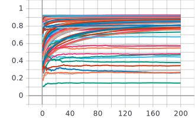
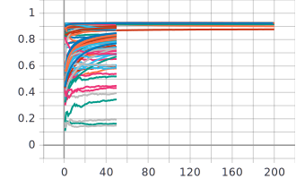
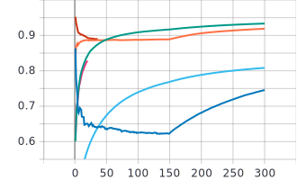
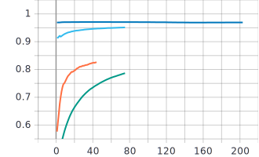
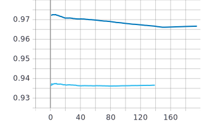
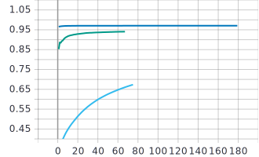
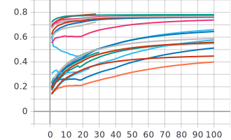
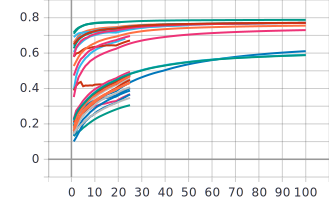

AutoGluon Image Classification Results
===

## CIFAR-10

### Search best hyperparameters for a fixed model

|                        | Prev. SOTA |          | Our      |          |           |          |
|------------------------|------------|----------|----------|----------|-----------|----------|
|                        |            |          | FIFO     |          | Hyperband |          |
|          Model         | Val acc    | Time (s) |  Val acc | Time (s) |  Val acc  | Time (s) |
| cifar_resnet20_v1      | 92.1       | 3290     | 92.5     | 75371    | 92.5      | 37070    |
| Command                |    |          | Com. [1] |          | Com. [2]  |          |
| Tensorboard            |    |          | Fig. [1] |          | Fig. [2]  |          |
|                        |            |          |          |          |           |          |
| cifar_resnext29_16x64d | 96.3       | 36379    | 95.2     | 57032    | 96.9      | 19595    |
| Command                |    |          | Com. [3] |          | Com. [4]  |          |
| Tensorboard            |    |          | Fig. [3] |          | Fig. [4]  |          |

```shell
Com. [1]
$ python train_cifar10.py --max_trial_count 100 --max_training_epochs 200

Com. [2]
$ python train_cifar10.py --max_trial_count 100 --max_training_epochs 200 
    --trial_scheduler hyperband

Com. [3]
$ python train_cifar10.py --nets cifar_resnext29_16x64d --max_trial_count 100 
    --max_training_epochs 300 --batch_size 32 --max_num_gpus 4

Com. [4]
$ python train_cifar10.py --nets cifar_resnext29_16x64d --max_trial_count 100 
    --max_training_epochs 300 --batch_size 32 --max_num_gpus 4 --trial_scheduler hyperband
```

#### Fig. [1]



#### Fig. [2]



#### Fig. [3]



#### Fig. [4]




### Search every hyperparameters


|             | Prev. SOTA |          | Our      |          |           |          |
|-------------|------------|----------|----------|----------|-----------|----------|
|             |            |          | FIFO     |          | Hyperband |          |
|             | Val acc    | Time (s) |  Val acc | Time (s) |  Val acc  | Time (s) |
|             | 96.3       | 36379    | 97.2     | 18265    | 97.1      | 17756    |
| Command     |            |          | Com. [5] |          | Com. [6]  |          |
| Tensorboard |            |          | Fig. [5] |          | Fig. [6]  |          |

```shell
Com. [5]
$ python train_cifar10.py --nets cifar_resnet20_v1,cifar_resnet56_v1,
    cifar_resnet110_v1,cifar_resnet20_v2,cifar_resnet56_v2,cifar_resnet110_v2,
    cifar_wideresnet16_10,cifar_wideresnet28_10,cifar_wideresnet40_8,cifar_resnext29_16x64d 
    --max_trial_count 1000 --max_training_epochs 300 --batch_size 32 --max_num_gpus 4

Com. [6]
$ python train_cifar10.py --nets cifar_resnet20_v1,cifar_resnet56_v1,
    cifar_resnet110_v1,cifar_resnet20_v2,cifar_resnet56_v2,cifar_resnet110_v2,
    cifar_wideresnet16_10,cifar_wideresnet28_10,cifar_wideresnet40_8,cifar_resnext29_16x64d 
    --max_trial_count 100 --max_training_epochs 300 --batch_size 32 --max_num_gpus 4 --trial_scheduler hyperband
```

#### Fig. [5]



#### Fig. [6]




## MINC

|             | Prev. SOTA                |          | Our      |          |           |          |
|-------------|---------------------------|----------|----------|----------|-----------|----------|
|             |                           |          | FIFO     |          | Hyperband |          |
|             | Val acc                   | Time (s) |  Val acc | Time (s) |  Val acc  | Time (s) |
|             | 77.6(finetune)/81.3(sota) | -        | 78.5     | 46469    | 78.8      | 45879    |
| Command     |                           |          | Com. [7] |          | Com. [8]  |          |
| Tensorboard |                           |          | Fig. [7] |          | Fig. [8]  |          |

```shell
Com. [7]
$ python prepare_minc.py --data ~/data/minc-2500 --split 1
$ python train_minc.py --data ~/data/minc-2500/ --nets resnet50_v1b --max_trial_count 400 
    --max_training_epochs 100 --batch_size 32 --lr_factor 0.1 --lr_step 20 --max_num_gpus 1 
    --max_num_cpus 8

Com. [8]
$ python prepare_minc.py --data ~/data/minc-2500 --split 1
$ python train_minc.py --data ~/data/minc-2500/ --nets resnet50_v1b --max_trial_count 400 
    --max_training_epochs 100 --batch_size 32 --lr_factor 0.1 --lr_step 20 --max_num_gpus 1 
    --max_num_cpus 8 --trial_scheduler hyperband
```

#### Fig. [7]



#### Fig. [8]

