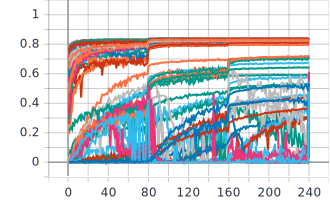
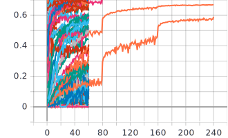

AutoGluon Object Detection Results
===

## Pascal VOC


|             | SOTA    |          | Our      |          |           |          |
|-------------|---------|----------|----------|----------|-----------|----------|
|             |         |          | FIFO     |          | Hyperband |          |
|             | Val mAP | Time (s) |  Val mAP | Time (s) |  Val mAP  | Time (s) |
|             | 80.1    | -        | 84.24    | -        | 69.93     | -        |
| Command     |         |          | Com. [1] |          | Com. [2]  |          |
| Tensorboard |         |          | Fig. [1] |          | Fig. [2]  |          |


```shell
Com. [1]
$ python train_ssd.py --max_trial_count 200 --max_training_epochs 240

Com. [2]
$ python train_ssd.py --max_trial_count 200 --max_training_epochs 240 --trial_scheduler hyperband
```

#### Fig. [1]



#### Fig. [2]


